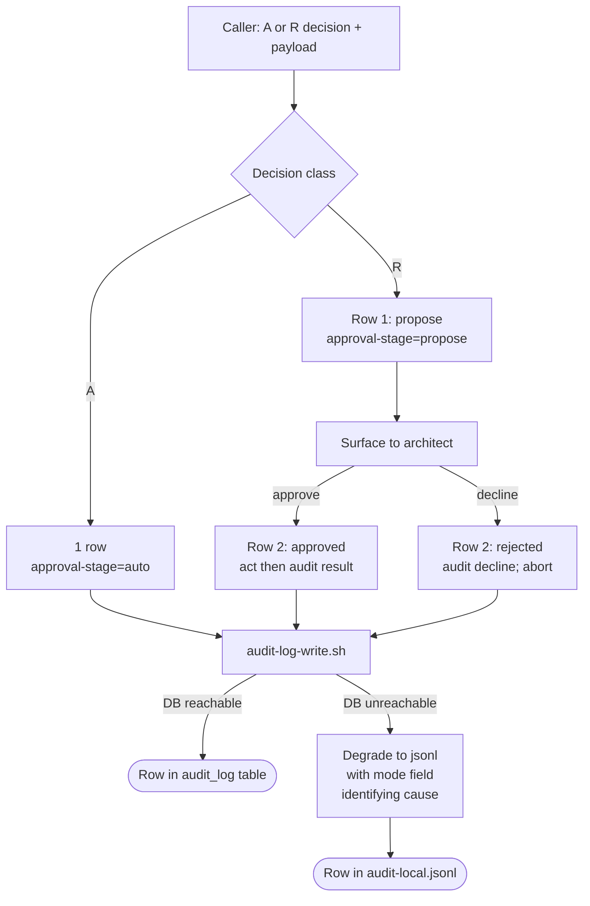

# auditing-actions

This skill is the audit-row writing authority. Every mutating action
the plugin performs leaves a trail of one or two rows in the audit log,
recording what was decided, who approved (if anyone), and what
happened when the action ran.

## Flow at a glance



## How to apply this skill

The caller has just received an A/R decision from
`board-superpowers:classifying-actions`. Now the caller invokes
`scripts/audit-log-write.sh` (located inside the board-superpowers
plugin) once for A-class actions or twice for R-class actions, with
structured args. Examples below assume the caller has resolved the
plugin root path; `scripts/lib/common.sh` ships a `bsp_plugin_root`
helper that does this cross-platform.

For A-class actions:

```bash
bash <plugin-root>/scripts/audit-log-write.sh \
  --action-id <int> \
  --decision A \
  --skill <calling-skill-name> \
  --approval-stage auto \
  --outcome <success|failure> \
  --payload '<json-per-action_id>'
```

For R-class actions, two invocations — propose, then resolve:

```bash
# Step 1: propose entry (before architect ack)
bash <plugin-root>/scripts/audit-log-write.sh \
  --action-id <int> --decision R --skill <name> \
  --approval-stage propose --outcome success \
  --payload '<proposal-json>'

# Step 2: resolve entry (after architect approves OR declines)
bash <plugin-root>/scripts/audit-log-write.sh \
  --action-id <int> --decision R --skill <name> \
  --approval-stage approved \         # OR rejected
  --outcome <success|failure> \       # OR success (for rejected)
  --payload '<full-action-json>'      # OR '<decline-reason-json>'
```

The script returns exit 0 when the row was written somewhere — to the
configured RDBMS (preferred) or to a host-local jsonl file (fallback).
The caller does NOT need to handle DB errors specially; the script
self-heals (recreating the venv if needed) and degrades gracefully.

## Quick reference

| What you have | What you need |
|---------------|---------------|
| an action just decided as A | invoke once with approval-stage=auto |
| an action just decided as R, before ack | invoke once with approval-stage=propose |
| architect approved an R-class proposal | invoke once with approval-stage=approved |
| architect declined an R-class proposal | invoke once with approval-stage=rejected |
| audit row schema details | read `references/schema.md` |
| per-action_id payload templates | read `references/db-write-conventions.md` |
| degradation behavior | read `references/degradation-mode.md` |

## What this skill does NOT cover

- **Deciding A vs R vs N** — that's `board-superpowers:classifying-actions`.
  This skill records what was decided.
- **Drafting the proposal text** — that's the molecular caller's UX
  responsibility. This skill writes the text into the `payload` field.
- **Surfacing degraded-mode warnings to the architect** — the script
  emits stderr WARN; architect may notice. This skill doesn't escalate.

This skill defines **how to record an action's audit trail**. The
caller decides what to do; this records it.
