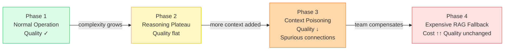
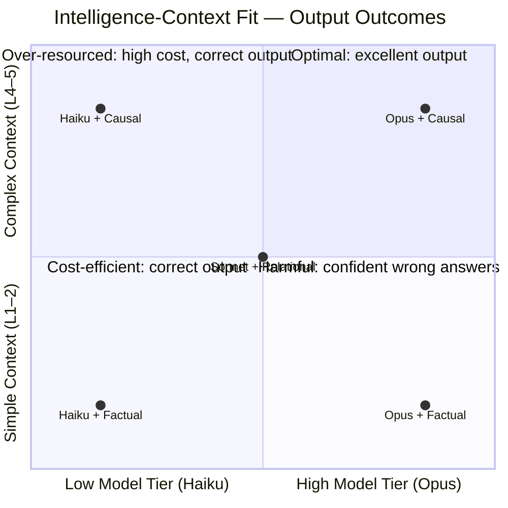

# Auditing Intelligence-Context Fit

## The Multiplicative Model

```
output_quality = reasoning_tier × context_quality
```

This is multiplicative. A mismatch in either dimension degrades output non-linearly:

| Reasoning Tier | Context Quality | Output |
|---|---|---|
| High | High | Excellent |
| High | Low | Mediocre (model can't compensate for bad retrieval) |
| Low | High | Mediocre (model can't leverage complex context) |
| Low | Low | Poor |
| Low | Very High (long, complex) | **Harmful** — model hallucinates connections in complex context it can't parse |

The last row is the "long context + weak reasoning = harmful output" failure. It's worse than simply poor because the model generates confident-sounding wrong answers.

---

## The Degradation Curve

As context complexity increases beyond a model's reasoning ceiling:

1. **Phase 1 — Normal operation**: Model handles context well; output quality matches expectation
2. **Phase 2 — Reasoning plateau**: Model is at capacity; quality stops improving even as context improves
3. **Phase 3 — Context poisoning**: Additional context overwhelms the model; it begins drawing spurious connections; quality degrades
4. **Phase 4 — Expensive RAG fallback**: System compensates by adding more retrieval passes, reranking, and chain-of-thought prompting — all of which add cost without fixing the root mismatch

Symptom of Phase 3–4: "We added better context and the answers got worse, so we added more prompting."



---

## The Fit Matrix



---

## The Audit Framework

### Step 1: Classify Context Complexity

Rate the complexity of the context being passed to the model on this scale:

| Level | Description | Example |
|---|---|---|
| 1 — Factual | Single documents, direct lookup | "What does policy X say?" |
| 2 — Comparative | Multiple documents, explicit comparison | "Compare options A, B, C" |
| 3 — Relational | Cross-document entity relationships | "What teams are affected by X?" |
| 4 — Temporal | Events across time, sequence reasoning | "How did this evolve over 6 months?" |
| 5 — Causal | Multi-hop causal chains | "What chain of decisions led to Y?" |

---

### Step 2: Assess Model Reasoning Tier

| Tier | Model Examples | Appropriate Context Complexity |
|---|---|---|
| Basic | Claude Haiku 4.5 | Level 1–2 |
| Mid | Claude Sonnet 4.6 | Level 1–4 |
| Advanced | Claude Opus 4.6 | Level 1–5 |

Note: Model capability evolves rapidly. Retest your tier assignments when new model versions release.

---

### Step 3: Identify the Mismatch

**Scenario A: Context too complex for model tier**
- Symptom: Confident but incorrect answers; spurious causal claims; inconsistent reasoning across runs
- Fix: Upgrade model tier OR simplify context (decompose into sub-queries at lower complexity levels)

**Scenario B: Model over-qualified for context**
- Symptom: Correct output but unnecessarily high cost and latency
- Fix: Downgrade model tier for this query class; reserve advanced models for Level 4–5 queries

**Scenario C: Context quality is the bottleneck, not model**
- Symptom: Upgrading the model doesn't improve output; answers are plausible but missing key facts
- Fix: Improve retrieval pipeline (check `diagnosing-rag-failure-modes`); model is not the constraint

**Scenario D: Context volume exceeds model window effectively**
- Symptom: Model ignores content from the middle of long contexts; only uses beginning/end
- Fix: Apply windowed compression (see `temporal-reasoning-sleuth`); reduce context length, not model

---

### Step 4: Prescribe the Fix

| Mismatch | Fix |
|---|---|
| High complexity, low-tier model | Upgrade model OR decompose query |
| Low complexity, high-tier model | Route to lower-tier model |
| Poor retrieval → poor context | Fix retrieval pipeline (not the model) |
| Context too long for model | Apply windowed compression |
| All tiers failing on one query type | Structural mismatch — needs hybrid architecture |

---

## Common Anti-Patterns

### Anti-Pattern: Haiku + Organizational History
Using a basic-tier model on Level 4–5 context complexity. The model confidently fills gaps it cannot reason over. The output looks plausible but contains fabricated causal connections.

**Fix**: Reserve causal/temporal queries for Sonnet or Opus tier. Use Haiku only for factual lookup (Level 1–2).

### Anti-Pattern: Opus on Simple RAG Lookups
Using an advanced-tier model for point-query factual retrieval. Correct output, but 5–10× the cost and latency of an appropriate tier.

**Fix**: Route Level 1–2 queries to Haiku; reserve Opus for Level 4–5 queries where reasoning depth matters.

### Anti-Pattern: Compensating with More Prompting
When output quality degrades, adding more system prompt, chain-of-thought instructions, and few-shot examples to compensate for a model-context mismatch. This adds cost and complexity without fixing the root cause.

**Fix**: Identify which step of the audit framework is the actual mismatch and fix it there.

---

## Output: Fit-Audit Report

```
INTELLIGENCE-CONTEXT FIT AUDIT
================================
System / Query Class: [what you're auditing]
Context Complexity Level: [1–5] — [description of why]
Current Model Tier: [Haiku / Sonnet / Opus]
Observed Symptom: [what's going wrong]

Mismatch Type: [Scenario A / B / C / D from Step 3]

Root Cause:
[One paragraph explaining the mismatch]

Recommended Fix:
[Specific action — upgrade model / decompose queries / fix retrieval / compress context]

Estimated Impact:
[Quality improvement expected] / [Cost change expected]

Related Skills:
[Link to diagnosing-rag-failure-modes / designing-hybrid-context-layers as applicable]
```
