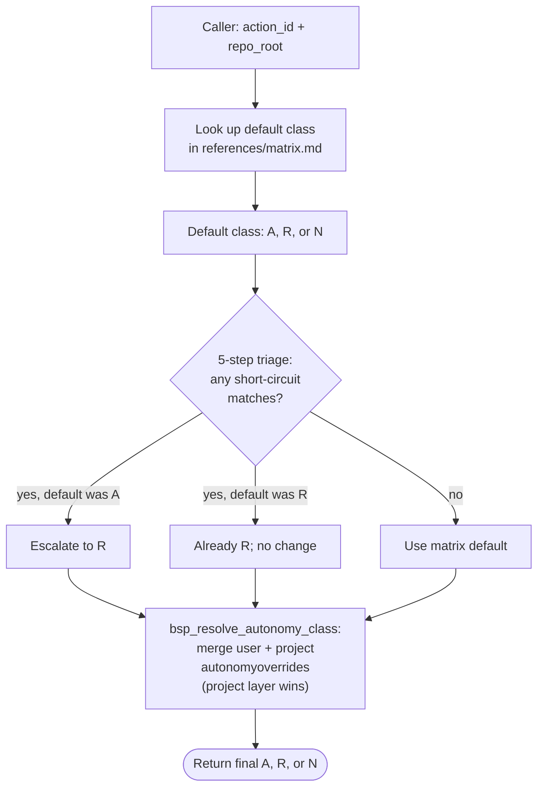

# classifying-actions

This skill is the decision-table authority for every mutating action a
board-superpowers SKILL performs. It answers "does this action proceed
automatically or wait for architect approval?" using:

1. A 14-row Producer matrix + 14-row Consumer catalog (see
   `references/matrix.md` + `references/action-id-catalog.md`).
2. A 5-step short-circuit triage rule that escalates Auto-class actions
   to Reserved-class when they touch architect-reserved powers, source
   of truth, in-flight work, or cross-card structure (see
   `references/triage-rule.md`).
3. A two-layer override system — user-level `~/.board-superpowers/overrides.yml`
   and project-level `<repo>/.board-superpowers/config.local.yml` —
   where project layer wins on conflict (see `references/override-parsing.md`).

## Decision tree at a glance

## How to apply this skill

Caller passes an `action_id` (an integer from the catalog) and the repo
root. Caller receives back one of:

- `A` — Auto. Caller acts immediately, then writes one audit row.
- `R` — Reserved. Caller drafts a proposal, surfaces to the architect,
  waits for ack, then acts and writes the resolve audit row.
- `N` — No-go. Caller refuses; surfaces the block reason. (No matrix
  row currently maps to N; the value exists for `autonomy_overrides:`
  users who want to disable specific actions outright.)

The decision algorithm:

1. Look up the action's default class in `references/matrix.md`.
2. Apply the 5-step triage rule from `references/triage-rule.md` —
   if any step matches and the matrix says A, escalate to R.
3. Invoke `bsp_resolve_autonomy_class <action_id> <repo_root>` (in
   `scripts/lib/common.sh`) to merge in any layered overrides.
4. Return the final class.

The helper handles yaml parsing of the override files via venv-managed
PyYAML; if venv is unavailable, the helper falls back to the matrix
default (this is conservative — overrides cannot promote R to A
without a working venv).

## Quick reference

| What you have | What you need |
|---------------|---------------|
| an action description | look up its `action_id` in `references/action-id-catalog.md` |
| an `action_id` | look up its default class in `references/matrix.md` |
| an Auto-class default | check `references/triage-rule.md` for escalation triggers |
| an override system question | read `references/override-parsing.md` |

## What this skill does NOT cover

- **Writing the audit row** — that's `board-superpowers:auditing-actions`.
  This skill decides; the other records.
- **Surfacing the proposal to the architect** — that's the molecular
  caller's UX responsibility (the four Producer routines / consuming-card /
  bootstrapping-repo).
- **Tracking proposal acks across architect prompts** — that's the
  caller's session-state responsibility.

This skill defines **what class an action is**. The caller decides
when and how to act on it.
