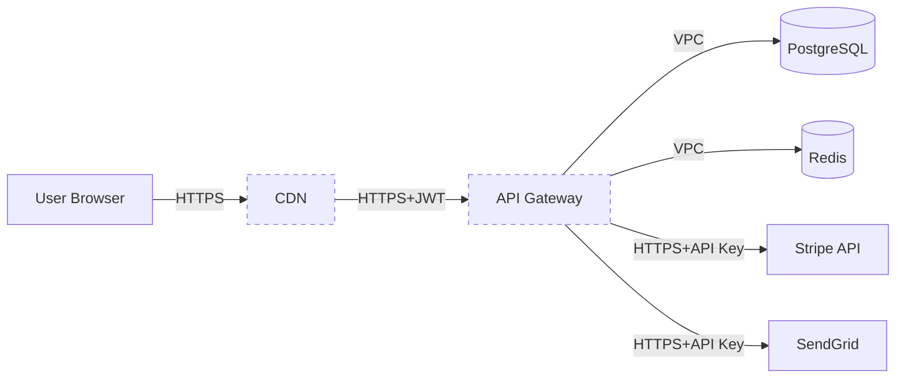

# pentest-threat-model

System threat modeling — STRIDE, DREAD, attack tree, DFD. Engagement basinda veya design review'da kullanilir.

## Triggers

- "threat model olustur"
- "STRIDE analizi"
- "DREAD scoring"
- "attack tree ciz"
- "data flow diagram"
- "MITRE ATT&CK matrix"

## STRIDE (Microsoft)

| Harf | Tehdit | Karsiti Property |
|------|--------|------------------|
| S | Spoofing identity | Authentication |
| T | Tampering with data | Integrity |
| R | Repudiation | Non-repudiation |
| I | Information disclosure | Confidentiality |
| D | Denial of service | Availability |
| E | Elevation of privilege | Authorization |

Her DFD elementine (Process, Data Store, Data Flow, Trust Boundary) STRIDE uygula.

## DREAD Scoring

| Boyut | 1 (Dusuk) | 5 (Yuksek) | 10 (Kritik) |
|-------|-----------|------------|-------------|
| Damage | Minimal | Major | Catastrophic |
| Reproducibility | Hard | Sometimes | Trivial |
| Exploitability | Hard | Moderate | Trivial (script) |
| Affected users | Few | Many | Most |
| Discoverability | Hidden | Apparent | Public docs |

Toplam: 50 max. Yuksek = high risk.

## DFD Yapisi

```
[External Entity] --> ((Process)) --> [Data Store]
                          |
                      Trust Boundary
                          |
                   ((Internal Service))
```

Komponentler:
- **External Entity** (kare): user, 3rd party API
- **Process** (daire): web server, microservice
- **Data Store** (silindir): database, cache
- **Data Flow** (ok): istek/yanit
- **Trust Boundary** (kesikli cizgi): VPC sinir, network zone

## Attack Tree Sablonu

```
Hedef: Steal credit card data
├── 1. Compromise web server
│   ├── 1.1 RCE via SQL injection
│   │   └── 1.1.1 Find SQLi in /api
│   ├── 1.2 Steal session cookie via XSS
│   └── 1.3 Brute force admin panel
├── 2. Compromise database directly
│   ├── 2.1 Internal port reachable
│   └── 2.2 Default credential
└── 3. Social engineer admin
    ├── 3.1 Phishing
    └── 3.2 Vishing IT helpdesk
```

Her leaf'e:
- DREAD score
- Likelihood (1-5)
- Cost to exploit (saat/gun)
- Detection (likely/possible/unlikely)

## MITRE ATT&CK Matrix Mapping

```yaml
threat_model:
  asset: Production database
  threats:
    - id: T-DB-001
      stride: I (Information disclosure)
      attack:
        tactic: TA0009 Collection
        technique: T1213 Data from Information Repositories
      dread: { damage: 9, repro: 7, exploit: 6, affected: 8, discover: 5 }
      score: 35
      mitigation:
        - DB encryption at rest
        - Access logging + SIEM rule
        - Network segmentation
```

## Output Sablonu

```markdown
## Threat Model — <system>

### System Description
- Frontend: React SPA on CDN
- Backend: Node.js API on Kubernetes
- Data: PostgreSQL (managed) + Redis (managed)
- 3rd party: Stripe, SendGrid, Auth0

### Trust Boundaries
1. CDN <-> API (TLS, JWT auth)
2. API <-> DB (VPC private subnet, IAM auth)
3. API <-> 3rd party (TLS + API key)

### Top 5 Threats (DREAD score)

| # | Threat | STRIDE | DREAD | Tactic |
|---|--------|--------|-------|--------|
| 1 | Stripe webhook spoofing (no sig verify) | T | 38 | Initial Access |
| 2 | JWT alg=none bypass | S+E | 36 | Initial Access |
| 3 | DB credential leak via 0/1-day | I | 33 | Credential Access |
| 4 | Redis SSRF via SSRF in URL param | I | 30 | Discovery |
| 5 | DoS via excessive GraphQL nesting | D | 28 | Impact |

### Mitigations
- Stripe: webhook signature verify (Stripe-Signature header)
- JWT: enforce alg whitelist (RS256 only)
- DB: rotate credentials quarterly, IAM auth (no static creds)
- SSRF: URL allowlist (no internal IP)
- GraphQL: max-depth 7, max-aliases 30
```

## Mermaid DFD Render



## Out-of-Scope

- Live attack execution (sadece modelleme)
- Existing model'i otomatik update (gerektikce manuel review)
