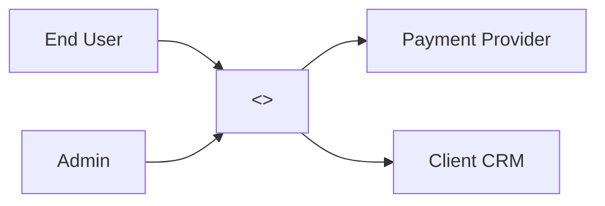

# Solution Architecture

> Part of the **discovery-phase** skill pack · `scoping` group · reads `scope-doc.md` (run `feature-scoping` first if missing) and feeds `estimation`.

Produces a discovery-grade architecture: enough detail to estimate effort, surface technical risks, and explain choices to the client — but not detailed design. Detailed design happens in delivery, not here. Where the BA isn't a tech lead, this skill is best run pair-mode with an architect; otherwise it produces vague boxes-and-arrows.

## Step 1 — Read context + scope

Read `discovery-context.md` (sections **2. Product / Initiative**, **6. Constraints**, **7. Tech Context**), then `scope-doc.md` (or `mvp-definition.md` if MVP track), then `risk-assumption-map.md`.

If `scope-doc.md` is missing, recommend `feature-scoping` first — architecture without a defined scope drifts into "general platform" territory and stops being useful for estimation.

If `discovery-context.md` is missing, ask inline: "(a) any client-mandated tech constraints (cloud, language, vendor)? (b) integration list — what must this connect to? (c) team's existing stack expertise?" — tag unknowns `[ASSUMED]`.

## Step 2 — System context (one diagram, in text)

Write a single system context diagram in text or Mermaid: **the system in the middle, actors on one side, external systems on the other**. This is the C4 "Level 1" view — no internals.

Explicitly state what's **out of scope** for this system (e.g., "billing UI is consumed from existing client portal, not built here"). Out-of-scope boundaries are where most estimation surprises hide.

## Step 3 — Logical components (3-7)

Decompose the system into 3-7 logical components — single-responsibility boxes. For each:

- **Name** — `<component>` (e.g., `auth-service`, `event-ingestion`, `report-generator`)
- **Responsibility** — one sentence, one job
- **Owns data?** — yes / no / shared
- **Talks to** — which other components / external systems
- **New or existing?** — building from scratch / extending existing client component / adopting a library

3 = too coarse to estimate, 7+ = pre-mature decomposition. If you need 8+, you're in detailed design — wrong skill.

## Step 4 — Critical data flows (top 2-3)

Pick the **2-3 most critical or highest-risk flows** and walk through them step by step. Examples:

- "User submits an order" — synchronous, must be ACID, 99.9% target
- "Daily reconciliation" — batch, eventually consistent, recoverable
- "Real-time dashboard update" — event-driven, lossy OK

For each flow, note: **sync vs async**, **failure mode**, **expected latency / volume**. These three properties drive infra cost more than feature count and are usually missing from estimations.

## Step 5 — Integrations + auth model

For every external system the architecture touches:

| Integration | Direction | Protocol | Auth model | Data ownership | Rate limits / SLA |
|---|---|---|---|---|---|

If any cell is `?`, it's either an open question for the client or a research task. Do not invent rate limits or SLAs — vendor docs are the source of truth.

Auth model gets a separate paragraph: who issues identity, who validates, where session lives, SSO requirements. Auth is the most under-estimated piece in agency proposals.

## Step 6 — Non-functional requirements (NFRs)

Concrete, measurable. No "fast", "secure", "scalable" — those are aspirations.

| NFR | Target | Source |
|---|---|---|
| Availability | <99.5% / 99.9% / 99.99%> | Client-stated or industry standard |
| Latency (p95) | <Xms for action Y> | UX requirement or benchmark |
| Throughput | <N rps / M events/sec> | Forecast or current peak × growth |
| Scale ceiling | <users / data volume / TPS> | Year-1 vs year-3 projections |
| Security / compliance | <SOC2 / GDPR / HIPAA / PCI / none> | Regulatory + client policy |
| Data retention | <duration + reason> | Compliance + product need |
| Observability | <logs / metrics / traces minimum> | Operational requirement |
| Recovery | <RTO / RPO> | Business continuity |

If the client hasn't stated an NFR, **state your assumption and tag it `[ASSUMED]`** — don't pretend NFRs don't exist. Unstated NFRs become contract disputes in delivery.

## Step 7 — Tech-stack rationale

For each major choice (language, framework, database, queue, deployment target), write **1-2 sentences of rationale** anchored on:

1. **Constraints** — client mandate, existing system, regulatory
2. **Team skills** — what the agency / client team can actually operate
3. **Fit-for-purpose** — why this tech matches the workload (not "it's modern")
4. **Operational cost** — license, hosting, ops effort

Avoid tech religion. If two stacks are equivalent on the first three, pick the one with cheaper ops. Always note the alternatives considered and why rejected — this is what a good architecture review looks for.

## Step 8 — Risk surface update

Re-read `risk-assumption-map.md`. Add any **new technical risks surfaced** during architecture work (e.g., "third-party SLA below our target", "no existing team experience with X"). For each existing tech risk in the map, note whether the proposed architecture **mitigates, accepts, or amplifies** it.

If 3+ new HIGH risks appear, the architecture is fragile — loop back, simplify, or escalate to the client.

## Step 9 — Pressure test (5 checks)

| Test | Question | Fix |
|---|---|---|
| **Estimable** | Can `estimation` derive effort from this without inventing? | Add missing components, NFRs, integrations |
| **Scope-aligned** | Does every component map to a scope item? Any orphan boxes? | Drop or justify; orphans = scope creep |
| **Constraint-honest** | Respects client-stated constraints (cloud, vendor, lang)? | Re-architect or surface as a contract negotiation |
| **NFR-grounded** | Are NFRs targets numerical, not aspirational? | Replace adjectives with numbers |
| **Risk-linked** | Does it touch every HIGH risk in the assumption map? | Mitigate, accept, or amplify each — explicitly |

If 2+ tests fail, the architecture isn't discovery-ready. Loop back rather than feeding shaky inputs into estimation.

## Step 10 — Write artifact

Output: `./discovery/solution-architecture.md` — see `./template.md`.

Append to `_log.md`: `[solution-architecture | YYYY-MM-DD] components: <N>; integrations: <M>; nfr_count: <K>; new_risks: <L>; assumed_count: 
`.

## Anti-patterns

- **Detailed design.** Class diagrams, ORM schemas, API contracts — wrong skill, wrong phase. Discovery architecture is C4 Level 1-2 max.
- **Tech-stack religion.** "We always use X" without rationale tied to constraints/skills/fit.
- **Aspirational NFRs.** "Fast, secure, scalable" is not an NFR. Numbers or `[ASSUMED]`.
- **Hidden integrations.** Every line in the system context diagram has cost. Enumerate or under-estimate.
- **Architecture without scope.** Producing this skill before `feature-scoping` produces "platform diagrams" that never match what's being built.
- **Over-decomposition.** 12 microservices in discovery is fan-fiction. Stay coarse.
- **Skipping operational concerns.** No deployment / observability / recovery plan = surprise costs in delivery.
